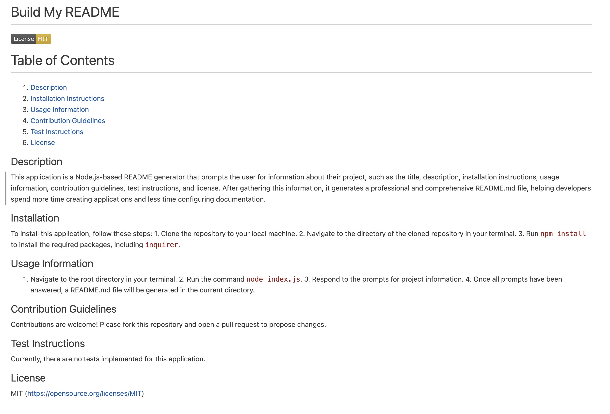

# Build-My-README

## Description

This application is a Node.js-based README generator that prompts the user for information about their project, such as the title, description, installation instructions, usage information, contribution guidelines, test instructions, and license. After gathering this information, it generates a professional and comprehensive README.md file, helping developers spend more time creating applications and less time configuring documentation.

## Table of Contents

- [Installation](#installation)
- [Usage](#usage)
- [License](#license)
- [Contributing](#contributing)
- [Tests](#tests)
- [Questions](#questions)

## Installation

To install this application, follow these steps:

1. Clone the repository to your local machine.
2. Navigate to the directory of the cloned repository in your terminal.
3. Run `npm install` to install the required packages, including `inquirer`.

## Usage

1. Navigate to the root directory in your terminal.
2. Run the command `node index.js`.
3. Respond to the prompts for project information.
4. Once all prompts have been answered, a README.md file will be generated in the current directory.

## License

This project is licensed under the MIT License.

## Contributing

Contributions are welcome! Please fork this repository and open a pull request to propose changes.

## Tests

Currently, there are no tests implemented for this application. 

## Questions

For any questions or concerns, please contact me on [GitHub](https://github.com/YourGitHubUsername) or email me at: your.email@example.com.

## Images and Links

Link to GitHub Repository: https://github.com/MMerzoug/Build-My-README.git

